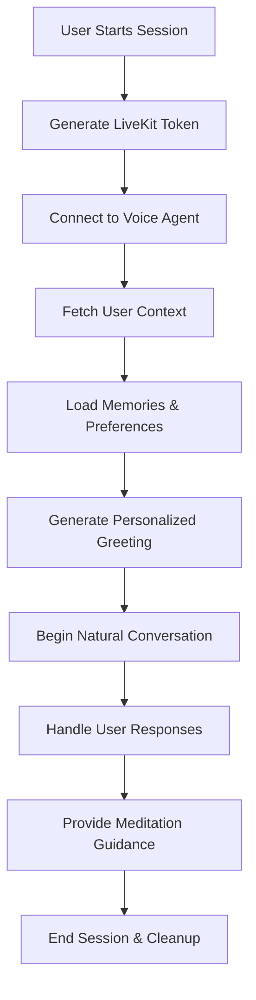

# Voice Agent Guide

## 🎙️ Overview

MindSphere includes a sophisticated real-time voice agent powered by LiveKit and OpenAI's Realtime API. The voice agent provides natural, conversational meditation guidance with memory-based personalization.

## 🏗️ Architecture

### Core Components
- **LiveKit Agents Framework** - Voice agent infrastructure
- **OpenAI Realtime API** - Natural conversation capabilities
- **Background Voice Cancellation** - Noise reduction and audio quality
- **Memory-Based Context** - Personalized responses using user data

### Key Files
- `voice-agent.ts` - Main voice agent implementation
- `src/components/VoiceAgent.tsx` - React component for voice sessions
- `src/pages/VoiceInterface.tsx` - Voice session interface
- `backend/src/routes_voice_token.js` - LiveKit token generation
- `livekit.toml` - LiveKit configuration

## 🚀 Features

### Voice Capabilities
- **Natural Conversations** - OpenAI Realtime API with Coral voice
- **Memory-Based Personalization** - Responses incorporate user memories and snippets
- **Real-Time Processing** - Low-latency voice interactions
- **Noise Cancellation** - Background voice cancellation for clear audio
- **Session Management** - Automatic room creation and cleanup

### Personalization
- **User Context Integration** - Fetches user memories and preferences
- **Dynamic Greetings** - Personalized introductions based on user data
- **Contextual Responses** - References user's meditation history and goals
- **Emotional Intelligence** - Adapts tone and content based on user's emotional state

## 🔧 Setup & Configuration

### Environment Variables
```env
# LiveKit Configuration
LIVEKIT_URL=wss://your-livekit-server.com
LIVEKIT_API_KEY=your_api_key
LIVEKIT_API_SECRET=your_api_secret

# OpenAI Configuration
OPENAI_API_KEY=your_openai_api_key

# Backend Configuration
BACKEND_URL=http://localhost:8000
```

### LiveKit Configuration (`livekit.toml`)
```toml
[project]
  subdomain = "your-project-subdomain"

[agent]
  id = "your-agent-id"
```

## 📱 Usage

### Starting a Voice Session
1. User clicks "Start Voice Session" in the app
2. Frontend requests LiveKit token from backend
3. Voice agent connects to LiveKit room
4. User context is fetched and loaded into agent
5. Personalized greeting is generated and spoken
6. Natural conversation begins

### Voice Session Flow


## 🧠 Personalization System

### User Context Fetching
The voice agent fetches user context from the backend:

```typescript
async function fetchUserContext(userId: string): Promise<string> {
  const response = await fetch(`${backendUrl}/api/voice/context/${userId}`);
  const context = await response.json();
  
  // Format context for AI
  let contextText = '';
  if (context.memories) {
    contextText += 'LONG-TERM MEMORY CONTEXT:\n';
    context.memories.forEach((memory, index) => {
      contextText += `${index + 1}. [${memory.category}] ${memory.content}\n`;
    });
  }
  
  if (context.snippets) {
    contextText += 'RECENT THOUGHTS & INSIGHTS:\n';
    context.snippets.forEach((snippet, index) => {
      contextText += `${index + 1}. ${snippet.content}\n`;
    });
  }
  
  return contextText;
}
```

### Personalized Greetings
The agent generates personalized greetings based on user context:

```typescript
let greetingInstructions = `Greet the user warmly and introduce yourself as their meditation guide. 
Keep your greeting brief and natural. Ask them how they're feeling today in a caring tone.
Be ready to help with meditation, breathing exercises, or emotional support.
Always respond in English only and keep responses conversational and concise.`;

if (userContextText) {
  greetingInstructions += `\n\nPERSONALIZATION REQUIREMENTS (CRITICAL):
  - ALWAYS incorporate the user's long-term memories and recent thoughts provided below
  - Reference specific details from their memories (objects, experiences, relationships, goals)
  - Use their recent thoughts and insights to shape the conversation's themes and guidance
  - Make the conversation deeply personal and relevant to their life experiences
  - Integrate their professional context, personal goals, and emotional state naturally
  
  ${userContextText}`;
}
```

## 🔐 Security & Token Management

### LiveKit Token Generation
```javascript
async function createToken({ roomName, participantName, participantIdentity }) {
  const at = new AccessToken(LIVEKIT_API_KEY, LIVEKIT_API_SECRET, {
    identity: participantIdentity || participantName,
    name: participantName,
    ttl: '15m',
  });
  
  at.addGrant({
    roomJoin: true,
    room: roomName,
    canPublish: true,
    canPublishData: true,
    canSubscribe: true,
    canUpdateOwnMetadata: true,
  });
  
  return at.toJwt();
}
```

### Room Management
- **Automatic Cleanup** - Rooms are deleted when participants disconnect
- **Secure Tokens** - 15-minute TTL with appropriate permissions
- **User Isolation** - Each user gets their own room for privacy

## 🎯 Voice Agent Instructions

### Core Personality
```typescript
const assistant = new Assistant({
  instructions: `You are a helpful voice AI assistant for MindSphere meditation app. 
  
  Your role:
  - Provide meditation guidance and mindfulness tips
  - Offer emotional support and encouragement
  - Guide users through breathing exercises
  - Help with stress relief and relaxation techniques
  
  Conversation style:
  - Always respond in a calm, soothing voice
  - Keep responses concise (1-2 sentences) for better realtime flow
  - Use natural pauses and breathing in your speech
  - Ask follow-up questions to understand the user's needs
  - If the user seems stressed, offer specific breathing exercises
  - Be empathetic and supportive in your tone
  - Always respond in English only`
});
```

## 🛠️ Development & Testing

### Local Development
```bash
# Start voice agent
npm run voice-agent:dev

# Start with specific user
npm run voice-agent:start -- --user-id=550e8400-e29b-41d4-a716-446655440000
```

### Testing Voice Sessions
1. Start the backend server
2. Start the voice agent
3. Open the frontend and navigate to voice interface
4. Click "Start Voice Session"
5. Test conversation flow and personalization

### Debugging
- Check LiveKit dashboard for room status
- Monitor OpenAI API usage and costs
- Review user context fetching in backend logs
- Test token generation and validation

## 📊 Performance Considerations

### Optimization
- **Connection Pooling** - Reuse LiveKit connections when possible
- **Context Caching** - Cache user context to reduce database queries
- **Token Refresh** - Implement token refresh for long sessions
- **Audio Quality** - Balance quality vs. latency for real-time performance

### Monitoring
- **Session Duration** - Track average session length
- **User Engagement** - Monitor conversation quality and user satisfaction
- **API Costs** - Monitor OpenAI Realtime API usage
- **Error Rates** - Track connection failures and retry attempts

## 🔮 Future Enhancements

### Planned Features
- **Multi-Language Support** - Support for multiple languages
- **Voice Cloning** - Custom voice options for users
- **Advanced Analytics** - Conversation quality metrics
- **Integration with Meditation Sessions** - Seamless transition from voice to guided meditation

### Technical Improvements
- **Better Error Handling** - Graceful degradation for network issues
- **Session Persistence** - Save and resume voice conversations
- **Advanced Personalization** - Machine learning-based response optimization
- **Scalability** - Support for multiple concurrent voice sessions

---

*Last updated: October 2024*
*Voice Agent Version: v4.0*
